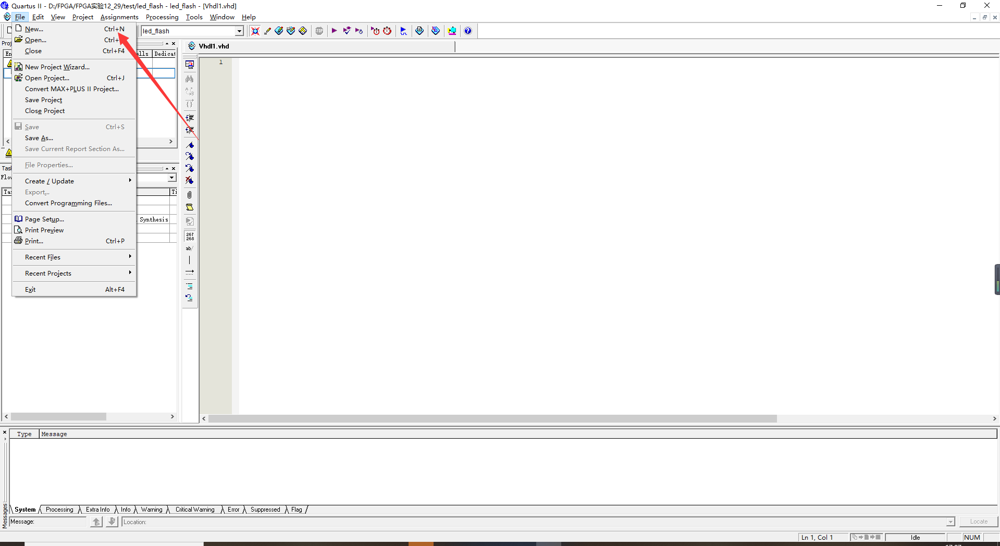
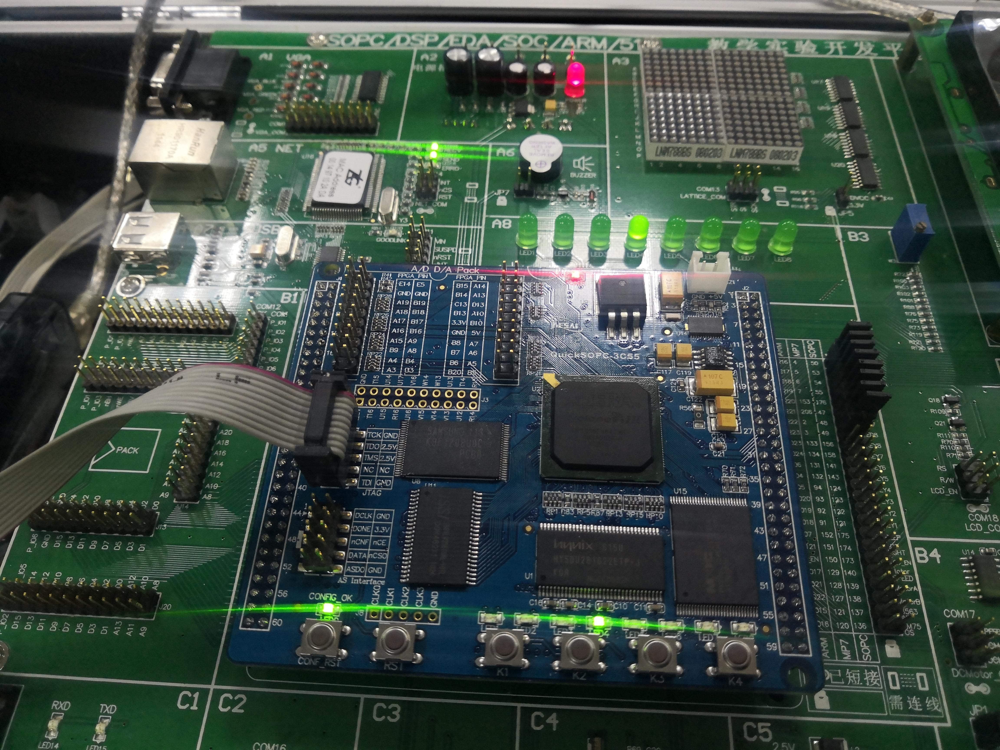

FPGA|VHDL入门实践第一发：使用VHDL编写程序控制FPGA芯片流水灯
<!--more-->

[TOC]

# LED的驱动及流水灯实验：

## **一、** **实验目的与要求**

​		实验目的与要求：让用户进一步了解、熟悉和掌握FPGA开发软件QuartusⅡ的使用方法以及VHDL的编程方法；同时了解简单时序电路的设计和硬件测试方法。

## **二、实验设备**

1. SmartSOPC+实验箱
2. 装有QuartusⅡ的PC机
3. JTAG下载器

## **三、实验内容**

​		在LED1~LED8引脚上周期性地输出流水数据，若原来输出的数据是111100则表示点亮LED1、LED2。流水输出一次后,输出数据应该为1111000, 而此时则应点亮LED1 ~LED3三个LED发光二极管,这样就可以实现LED流水灯。为了观察方便，流水速率最好在2Hz左右。在QuickSOPC核心板上有一48MHz的标准时钟源,该时钟脉冲CLOCK与芯片的28脚相连。为了产生2Hz的时钟脉冲,在此编写一个分频程序，通过修改分频系数来变改输出频率。当分频系数为24X100时,输出即为2Hz的频率信号。

## **四、实验步骤** 

1. 启动Quartus9.0建立一个空白工程，然后命名为led_flash.qpf。

- 新建工程


- 点击next输入文件信息


- 新建VHDL程序文件

  新建文件

  选择VHDL
    

- 创建完成：


- 按名称保存


2. 新建VHDL源程序文件vhd文件，编写程序代码并保存（注意第一个实体必须和文件名称一致） ,然后进行综合编译。若在编译过程中发现错误，则找出并更正错误，直至编译成功为止。


3. 编译完成后将芯片引脚分配

- 打开引脚分配


- 变量名对应IO口


- 多余的IO口要设置三态输入保护芯片（如下三步走）

打开DEVIEC


点开Pin设置，找到多余引脚点开


选择三态输入


4. 编译完成最后将Altera ByteBlaster Il下载电缆的两端分别接到PC机的打印机并口和QuickSOPC核芯板上的JTAG下载口上，打开电源，执行下载命令,把程序下载到FPGA器件中。此时,即可在SmartSOPC实验箱上看到流水灯。

- 点击下载按键


- 按照以下四步下载程序，此处我没有连接试验箱

选择文件


点击下载


## **五、设计程序**

 程序设计分为两个部分：

1. 第一部分：根据48M时钟信号输入引脚clk来做分频，配置每个计数的间隔时间。

   **时钟分频代码：**

```vhdl
	process(sys_clk)
		variable num: integer range 1 to 24000000;
	begin
		if rising_edge(sys_clk) then
			if num=24000000
				then num :=1; clk<=not clk;
				else num :=num+1;
			end if;
		end if;
	end process;
```

2. 第二部分：对分频后的跳变进行计数，根据计数的数目，来改变LED引脚的输出状态，此处我采用的是使用case选择语句，在每个计数周期到来时，对数字count进行计数，count范围0-7，依次循环，case根据判断结果输出led电平。

   **计数代码：**

```vhdl
	process(clk)
		variable n:integer range 0 to 7;
	begin
	
	if rising_edge (clk) then
		if n=7 then n:=0;
			else n:=n+1;
		end if ;
	end if;
```

​		**case选择判断代码:**

```vhdl
	case n is
		when 0=>led<="01111111";
		when 1=>led<="10111111";
		when 2=>led<="11011111";
		when 3=>led<="11101111";
		when 4=>led<="11110111";
		when 5=>led<="11111011";
		when 6=>led<="11111101";
		when 7=>led<="11111110";
		when others=>led<="11111111";
	end case;
```


## **六、实验结果及分析**

**运行图像：**




**分析：**

程序下载之后8个LED轮流点亮，符合预期效果。

